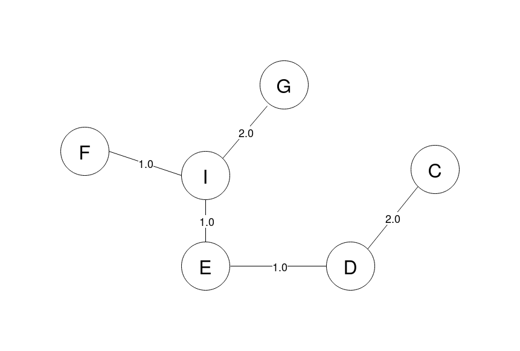

---
title: Algorithms and Data Structures 2010 May Exam
author: Nathan Sharp | s1869292 | B130263
date: 15-12-2020 
...


# Question 1

(a). _State the definitions of a 'spanning subgraph', 'weight' of a subgraph and 'minimum spanning tree'._

__spanning subgraph__ of a graph, $\mathcal{G}= VE$, is a subset of $\mathcal{G}$ containing all vertices, $V$ and a subset of the edges $E$.

__weight of a subgraph__ the weight of a subgraph is the summation of the individual weight of all its edges. 

__minimum spanning tree__ of a graph $\mathcal{G}$ is a connected spanning subgraph $\mathcal{T}$ of $\mathcal{G}$ of minimum weight.

(b). _State prim' algorithm in pseudocode. For an input graph with $n$ vertices and $m$ edges what is its running time?_

>__Algorithm__ _Prim_($\mathcal{G}$ : ($VE$) , $w$ : Weight Matrix) $\rightarrow$ $\mathcal{T}$ : MST

>  1. $\mathcal{T}$ $\gets$ arbitrary $v \in G$ $\quad$ # $v$ is an vertex in $V$
  2. __while__ fringe edge exists in $\mathcal{T}$:
  3. $\quad$ add fringe edge of minimum weight to $\mathcal{T}$
  4. __return__ $\mathcal{T}$

where a __fringe edge__ is an edge of the subtree $\mathcal{T}$ with exactly one endpoint in $\mathcal{T}$.

Runtime is dependent on how the data structure is implemented, specifically, the _priority queue_ used to find the minimum weight fringe edge in $\mathcal{T}$ with runtimes as follows,

| Data Structure   | Runtime                          |
|------------------|----------------------------------|
| Array            | $T(n,m) = \Theta(n^2)$           |
| Heap             | $T(n,m) = \Theta((n+m) \log(n))$ |
| Fibonacci Heap   | $T(n,m) = \Theta(n \log(n) + m)$ |


(c). _Illustrate how Prim's algorithm proceses the following input by indicating for each step of the main loop what edges Prim's algorithm has selected._

1. {AB}
2. {AB, BC}
3. {AB, BC, CD}
4. {AB, BC, CD, DE}
5. {AB, BC, CD, DE, DH}
6. {AB, BC, CD, DE, DH, EI}
7. {AB, BC, CD, DE, DH, EI, IF}
8. {AB, BC, CD, DE, DH, EI, IF, IG}
9. {AB, BC, CD, DE, DH, EI, IF, IG}

(d). _Assume that $\mathcal{G}=VE,w)$ is a connected edge-weighted graph and that $T \subset V$ is a non-empty set of vertices. A 'Steiner tree' for $T$ is a connected (but not necessarily spanning) subgraph $H = (V_H,E_H$) of $G$ that is a tree and whose vertex set $V_H$ contains $T$ as a subset. Its weight is_

$$ w(H) = \sum_{e \in E_H} w(e) $$

_In the example graph from (c), find a steiner tree of minimum weight for $T=\{C,E,F,G\}$._

Solution, 



(e). _Suppose that an edge weighted connected graph $G= (V,E,w)$ with $n$ vertices and $m$ edges and a set $T \subset V$ are given. Devise an algorithm that computer an optimal Steiner tree in time $(2+o(1))^n$. Also provide an informl argument as to why your algorithm produces the correct output and why it has the desired running time._

```python 
def steiner(G,w,T) -> H:
  H = T[0]  # any edge in T will do
  # initialise a priority queue of edges in T 
  # sorted by path distance to H 
  Q = priorityQueue(T, dist_to_H)  
  while not Q.isEmpty():
    t = Q.pop() 
    H += min_path(t, H)

  return H
```

The algorithm produces the correct output 


